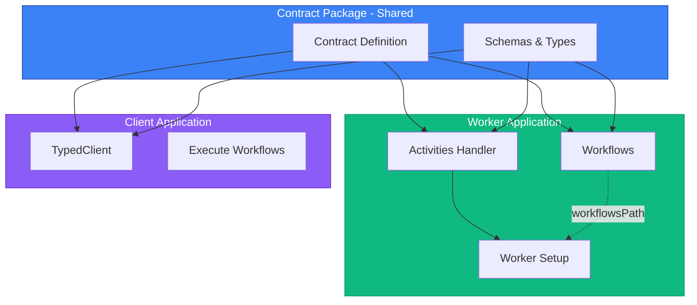

# Entry Points Architecture

Understanding how temporal-contract handles the separation between activities and workflows.

## Why Separate Entry Points?

Temporal requires workflows to be loaded via `workflowsPath` for sandboxing and determinism. This architectural decision means:

1. **Activities** are loaded directly into the Worker
2. **Workflows** are loaded from a separate file path

temporal-contract respects this architecture while providing type safety across both.

## Architecture Overview



## File Structure

Recommended project structure with separate contract package:

```
contract-package/           # Shared contract package
├── src/
│   ├── contract.ts        # Contract definition
│   ├── schemas.ts         # Domain schemas
│   └── index.ts          # Package exports
└── package.json          # Package configuration

worker-application/        # Worker implementation
├── src/
│   ├── activities/
│   │   └── index.ts      # Activities handler
│   ├── workflows/
│   │   └── order.workflow.ts  # Workflow implementations
│   └── worker.ts         # Worker setup
└── package.json          # Imports contract-package

client-application/        # Client (can be separate app)
├── src/
│   └── client.ts         # Client code
└── package.json          # Imports contract-package
```

## Contract Definition

Define your contract in a separate package that can be shared:

```typescript
// contract-package/src/contract.ts
import { defineContract } from "@temporal-contract/contract";
import { z } from "zod";

export const orderContract = defineContract({
  taskQueue: "orders",

  activities: {
    sendEmail: {
      input: z.object({ to: z.string(), body: z.string() }),
      output: z.object({ sent: z.boolean() }),
    },
  },

  workflows: {
    processOrder: {
      input: z.object({ orderId: z.string() }),
      output: z.object({ success: z.boolean() }),
      activities: {
        processPayment: {
          input: z.object({ amount: z.number() }),
          output: z.object({ transactionId: z.string() }),
        },
      },
    },
  },
});
```

```typescript
// contract-package/src/index.ts
export { orderContract } from "./contract.js";
// Export schemas and types as needed
```

## Activities Entry Point

Create a single activities handler in your worker application:

```typescript
// worker-application/src/activities/index.ts
import { declareActivitiesHandler, ActivityError } from "@temporal-contract/worker/activity";
import { Future, Result } from "@swan-io/boxed";
import { orderContract } from "contract-package";

export const activities = declareActivitiesHandler({
  contract: orderContract,
  activities: {
    sendEmail: ({ to, body }) => {
      return Future.fromPromise(emailService.send({ to, body }))
        .mapError(
          (error) =>
            new ActivityError(
              "EMAIL_FAILED",
              error instanceof Error ? error.message : "Failed to send email",
              error,
            ),
        )
        .mapOk(() => ({ sent: true }));
    },
    processPayment: ({ amount }) => {
      return Future.fromPromise(paymentGateway.charge(amount))
        .mapError(
          (error) =>
            new ActivityError(
              "PAYMENT_FAILED",
              error instanceof Error ? error.message : "Payment failed",
              error,
            ),
        )
        .mapOk((txId) => ({ transactionId: txId }));
    },
  },
});
```

## Workflows Entry Point

Create separate workflow files in your worker application:

```typescript
// worker-application/src/workflows/order.workflow.ts
import { declareWorkflow } from "@temporal-contract/worker/workflow";
import { orderContract } from "contract-package";

export const processOrder = declareWorkflow({
  workflowName: "processOrder",
  contract: orderContract,
  activityOptions: { startToCloseTimeout: "1 minute" },
  implementation: async (context, args) => {
    const payment = await context.activities.processPayment({
      amount: 100,
    });

    await context.activities.sendEmail({
      to: "customer@example.com",
      body: `Order ${args.orderId} processed`,
    });

    return { success: true };
  },
});
```

## Worker Setup

Wire everything together in your worker application:

```typescript
// worker-application/src/worker.ts
import { Worker } from "@temporalio/worker";
import { orderContract } from "contract-package";
import { activities } from "./activities";

const worker = await Worker.create({
  // Workflows loaded from path (Temporal requirement)
  workflowsPath: require.resolve("./workflows/order.workflow"),

  // Activities loaded directly (handler is a flat object)
  activities,

  // Task queue from contract
  taskQueue: orderContract.taskQueue,
});

await worker.run();
```

## Client Application

Use the contract in a separate client application (can be in a different codebase):

```typescript
// client-application/src/client.ts
import { Connection, Client } from "@temporalio/client";
import { TypedClient } from "@temporal-contract/client";
import { orderContract } from "contract-package";

// Connect to Temporal server
const connection = await Connection.connect({
  address: "localhost:7233",
});

// Create Temporal client and type-safe client from contract
const temporalClient = new Client({ connection, namespace: "default" });
const client = TypedClient.create(orderContract, temporalClient);

// Start workflow with full type safety (returns Future<Result<TypedWorkflowHandle, ...>>)
const handleResult = await client.startWorkflow("processOrder", {
  workflowId: "order-123",
  args: { orderId: "ORD-123" }, // ✅ Type-checked!
});

// Unwrap the Result and wait for the workflow result
handleResult.match({
  Ok: async (handle) => {
    const result = await handle.result();
    result.match({
      Ok: (output) => console.log(output.success), // ✅ TypeScript knows the shape
      Error: (error) => console.error("Workflow failed:", error),
    });
  },
  Error: (error) => console.error("Failed to start workflow:", error),
});
```

## Multiple Workflows

For multiple workflows, export them all from a single file:

```typescript
// workflows/index.ts
export * from "./order.workflow";
export * from "./shipment.workflow";
export * from "./refund.workflow";
```

```typescript
// worker.ts
const worker = await Worker.create({
  workflowsPath: require.resolve("./workflows"),
  activities,
  taskQueue: orderContract.taskQueue,
});
```

## Type Safety Across Boundaries

Despite the separation, type safety is maintained:

### From Contract to Activities

```typescript
// Contract defines the shape
const contract = defineContract({
  activities: {
    processPayment: {
      input: z.object({ amount: z.number() }),
      output: z.object({ transactionId: z.string() }),
    },
  },
});

// Activities handler must match — must return Future<Result<T, ActivityError>>
declareActivitiesHandler({
  contract,
  activities: {
    processPayment: ({ amount }) => {
      // ✅ amount is number
      return Future.value(Result.Ok({ transactionId: "TXN-123" }));
      // ✅ Must return Future<Result<{ transactionId: string }, ActivityError>>
    },
  },
});
```

### From Contract to Workflows

```typescript
// Workflow context is typed from contract
declareWorkflow({
  workflowName: "processOrder",
  contract,
  activityOptions: { startToCloseTimeout: "1 minute" },
  implementation: async (context, args) => {
    // ✅ TypeScript knows processPayment exists
    const result = await context.activities.processPayment({
      amount: 100, // ✅ Type checked
    });

    // ✅ result.transactionId is string
    console.log(result.transactionId);
  },
});
```

## Benefits of This Architecture

### 1. Contract Reusability

The contract package can be imported by multiple applications:

- Worker application (to implement)
- Client applications (to consume)
- Even other services that need the type definitions

### 2. Type Safety

Full TypeScript inference across all boundaries and applications.

### 3. Validation

Automatic validation at:

- Workflow entry/exit
- Activity calls
- Client requests

### 4. Temporal Compliance

Respects Temporal's architecture requirements.

### 5. Independent Deployment

- Contract package can be versioned independently
- Client applications can be in different codebases
- Workers and clients can be deployed separately

### 6. Testability

Activities and workflows can be tested independently:

```typescript
// Test activities directly (handler is a flat object)
const result = await activities.processPayment({
  amount: 100,
});

// Test workflows with mock context
const workflow = processOrder.implementation;
const mockContext = createMockContext();
await workflow(mockContext, { orderId: "ORD-123" });
```

### 7. Organization

Clear separation of concerns:

- Contract package: API definition
- Worker application: Implementation
- Client application: Consumption

## Common Patterns

### Pattern 1: Shared Activities

```typescript
// activities/shared.ts
import { Future, Result } from "@swan-io/boxed";

export const sharedActivities = {
  sendEmail: ({ to, body }) => Future.value(Result.Ok({ sent: true })),
  logEvent: ({ event }) => Future.value(Result.Ok({ logged: true })),
};

// activities/order.ts
import { sharedActivities } from "./shared";

export const orderActivities = declareActivitiesHandler({
  contract: orderContract,
  activities: {
    ...sharedActivities,
    processPayment: ({ amount }) => Future.value(Result.Ok({ transactionId: "TXN" })),
  },
});
```

### Pattern 2: Activity Composition

```typescript
// activities/index.ts
import { Future, Result } from "@swan-io/boxed";

const baseActivities = {
  validateInput: ({ data }) => Future.value(Result.Ok({ valid: true })),
};

const paymentActivities = {
  processPayment: ({ amount }) => Future.value(Result.Ok({ transactionId: "TXN" })),
};

export const activities = declareActivitiesHandler({
  contract: orderContract,
  activities: {
    ...baseActivities,
    ...paymentActivities,
  },
});
```

## See Also

- [Worker Implementation](/guide/worker-implementation)
- [Activity Handler Types](/guide/activity-handlers)
- [Getting Started](/guide/getting-started)
