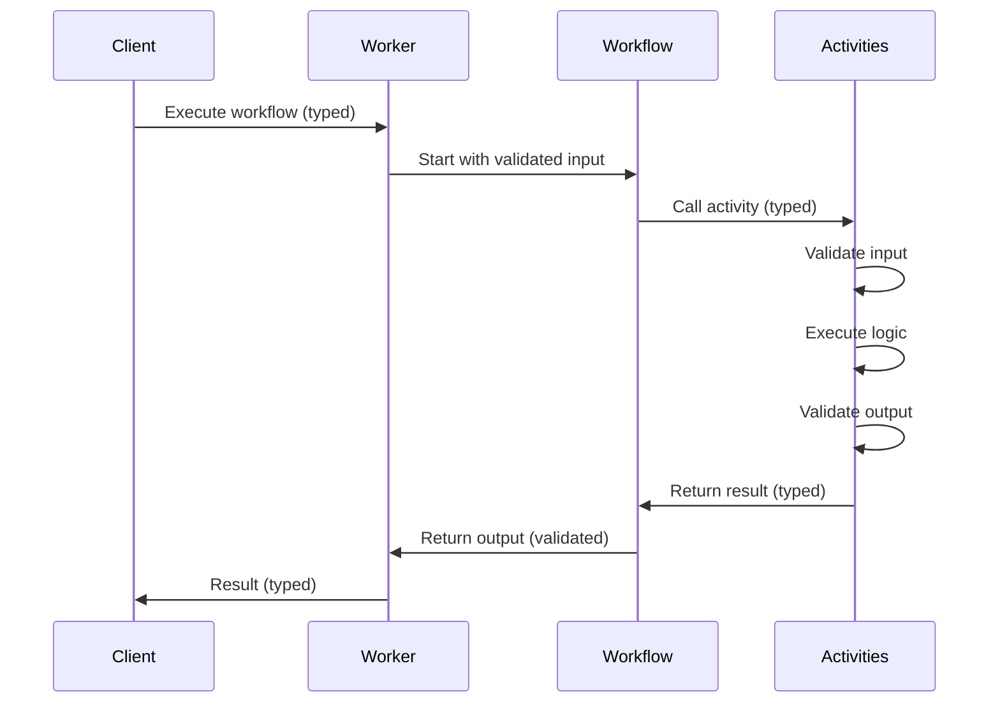
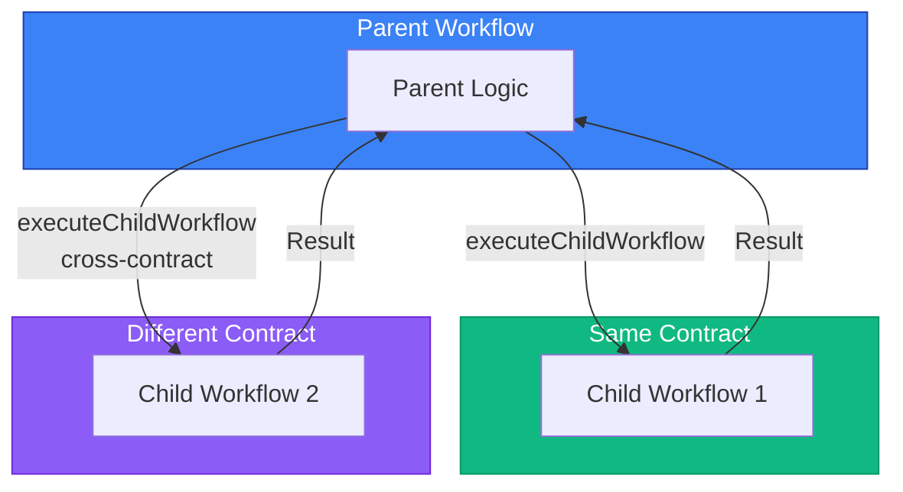

# Worker Implementation

This guide explains how to implement workers using temporal-contract.

## Overview

The `@temporal-contract/worker` package provides functions for implementing Temporal workers with full type safety:

1. **`declareActivitiesHandler`** - Implements all activities (global + workflow-specific)
2. **`declareWorkflow`** - Implements individual workflows with typed context

## Workflow Execution Flow



## Activities Handler

Create a handler for all activities using the Result/Future pattern:

```typescript
import { declareActivitiesHandler, ActivityError } from "@temporal-contract/worker/activity";
import { Future, Result } from "@swan-io/boxed";
import { myContract } from "./contract";

export const activities = declareActivitiesHandler({
  contract: myContract,
  activities: {
    // Global activities - use Future/Result for explicit error handling
    sendEmail: ({ to, subject, body }) => {
      return Future.fromPromise(emailService.send({ to, subject, body }))
        .mapError(
          (error) =>
            new ActivityError(
              "EMAIL_FAILED",
              error instanceof Error ? error.message : "Failed to send email",
              error,
            ),
        )
        .mapOk(() => ({ sent: true }));
    },

    // Workflow-specific activities
    processPayment: ({ customerId, amount }) => {
      return Future.fromPromise(paymentGateway.charge(customerId, amount))
        .mapError(
          (error) =>
            new ActivityError(
              "PAYMENT_FAILED",
              error instanceof Error ? error.message : "Payment failed",
              error,
            ),
        )
        .mapOk((txId) => ({ transactionId: txId, success: true }));
    },
  },
});
```

## Workflow Implementation

Implement workflows with typed context. Activities called from workflows return plain values (Result is unwrapped internally):

```typescript
import { declareWorkflow } from "@temporal-contract/worker/workflow";
import { myContract } from "./contract";

export const processOrder = declareWorkflow({
  workflowName: "processOrder",
  contract: myContract,
  activityOptions: { startToCloseTimeout: "1 minute" },
  implementation: async (context, args) => {
    // context.activities is fully typed
    // Activities return plain values (Result is unwrapped by the framework)
    const payment = await context.activities.processPayment({
      customerId: args.customerId,
      amount: 100,
    });

    await context.activities.sendEmail({
      to: args.customerId,
      subject: "Order Confirmed",
      body: "Your order has been processed",
    });

    // Return plain object (not Result)
    return {
      status: payment.success ? "success" : "failed",
      transactionId: payment.transactionId,
    };
  },
});
```

## Worker Setup

Set up the Temporal worker:

```typescript
import { Worker } from "@temporalio/worker";
import { activities } from "./activities";

const worker = await Worker.create({
  workflowsPath: require.resolve("./workflows"),
  activities,
  taskQueue: "my-task-queue", // or myContract.taskQueue
});

await worker.run();
```

## Type Safety Features

### Input Validation

All activity and workflow inputs are automatically validated:

```typescript
// ✅ Valid - matches schema
await context.activities.processPayment({
  customerId: "CUST-123",
  amount: 100,
});

// ❌ Invalid - throws validation error
await context.activities.processPayment({
  customerId: 123, // Should be string
  amount: -10, // Should be positive
});
```

### Output Validation

Return values are validated against output schemas:

```typescript
// ✅ Valid
return { transactionId: "TXN-123", success: true };

// ❌ Invalid - TypeScript error + runtime validation
return { txId: "TXN-123" }; // Wrong field name
```

### Typed Context

The workflow context is fully typed based on your contract:

```typescript
implementation: async (context, args) => {
  // TypeScript knows all available activities
  context.activities.processPayment; // ✅ Available
  context.activities.unknownActivity; // ❌ TypeScript error

  // Full autocomplete for parameters
  await context.activities.processPayment({
    // IDE shows: customerId: string, amount: number
  });
};
```

## Child Workflows

Execute child workflows with type-safe Future/Result pattern. Child workflows can be from the same contract or from a different contract (cross-worker communication).



### Basic Usage

```typescript
import { declareWorkflow } from "@temporal-contract/worker/workflow";
import { myContract, notificationContract } from "./contracts";

export const parentWorkflow = declareWorkflow({
  workflowName: "parentWorkflow",
  contract: myContract,
  activityOptions: { startToCloseTimeout: "1 minute" },
  implementation: async (context, args) => {
    // Execute child workflow from same contract and wait for result
    const result = await context.executeChildWorkflow(myContract, "processPayment", {
      workflowId: `payment-${args.orderId}`,
      args: { amount: args.totalAmount },
    });

    result.match({
      Ok: (output) => console.log("Payment processed:", output),
      Error: (error) => console.error("Payment failed:", error),
    });

    return { success: true };
  },
});
```

### Cross-Contract Child Workflows

Invoke child workflows from different contracts and workers:

```typescript
export const orderWorkflow = declareWorkflow({
  workflowName: "processOrder",
  contract: orderContract,
  activityOptions: { startToCloseTimeout: "1 minute" },
  implementation: async (context, args) => {
    // Process payment in same contract
    const paymentResult = await context.executeChildWorkflow(orderContract, "processPayment", {
      workflowId: `payment-${args.orderId}`,
      args: { amount: args.total },
    });

    if (paymentResult.isError()) {
      return { status: "failed", reason: "payment" };
    }

    // Send notification using another worker's contract
    const notificationResult = await context.executeChildWorkflow(
      notificationContract,
      "sendOrderConfirmation",
      {
        workflowId: `notify-${args.orderId}`,
        args: { orderId: args.orderId, email: args.customerEmail },
      },
    );

    return {
      status: "completed",
      transactionId: paymentResult.value.transactionId,
    };
  },
});
```

### Start Without Waiting

Use `startChildWorkflow` to start a child workflow without waiting for its result:

```typescript
export const orderWorkflow = declareWorkflow({
  workflowName: "processOrder",
  contract: myContract,
  activityOptions: { startToCloseTimeout: "1 minute" },
  implementation: async (context, args) => {
    // Start background notification workflow
    const handleResult = await context.startChildWorkflow(notificationContract, "sendEmail", {
      workflowId: `email-${args.orderId}`,
      args: { to: args.customerEmail, subject: "Order received" },
    });

    handleResult.match({
      Ok: async (handle) => {
        // Child workflow started successfully
        // Can wait for result later if needed
        const result = await handle.result();
      },
      Error: (error) => {
        console.error("Failed to start notification:", error);
      },
    });

    return { success: true };
  },
});
```

### Error Handling

Child workflow errors are returned as `ChildWorkflowError`:

```typescript
const result = await context.executeChildWorkflow(myContract, "processPayment", {
  workflowId: "payment-123",
  args: { amount: 100 },
});

result.match({
  Ok: (output) => {
    // Child workflow completed successfully
    console.log("Transaction ID:", output.transactionId);
  },
  Error: (error) => {
    // Handle child workflow errors
    if (error instanceof ChildWorkflowNotFoundError) {
      console.error("Workflow not found in contract");
    } else {
      console.error("Child workflow failed:", error.message);
    }
  },
});
```

## Best Practices

### 1. Separate Activity Files

Organize activities by domain:

```typescript
// activities/payment.ts
import { Future, Result } from "@swan-io/boxed";
import { ActivityError } from "@temporal-contract/worker/activity";

export const paymentActivities = {
  processPayment: ({ customerId, amount }) => {
    return Future.fromPromise(paymentGateway.charge(customerId, amount))
      .mapError((err) => new ActivityError("PAYMENT_FAILED", err.message, err))
      .mapOk((tx) => ({ transactionId: tx.id }));
  },
  refundPayment: ({ transactionId }) => {
    return Future.fromPromise(paymentGateway.refund(transactionId))
      .mapError((err) => new ActivityError("REFUND_FAILED", err.message, err))
      .mapOk(() => ({ refunded: true }));
  },
};

// activities/email.ts
import { Future, Result } from "@swan-io/boxed";
import { ActivityError } from "@temporal-contract/worker/activity";

export const emailActivities = {
  sendEmail: ({ to, subject, body }) => {
    return Future.fromPromise(emailService.send({ to, subject, body }))
      .mapError((err) => new ActivityError("EMAIL_FAILED", err.message, err))
      .mapOk(() => ({ sent: true }));
  },
};

// activities/index.ts
import { declareActivitiesHandler } from "@temporal-contract/worker/activity";
import { paymentActivities } from "./payment";
import { emailActivities } from "./email";

export const activities = declareActivitiesHandler({
  contract: myContract,
  activities: {
    ...paymentActivities,
    ...emailActivities,
  },
});
```

### 2. Use Dependency Injection

Make activities testable:

```typescript
import { Future, Result } from "@swan-io/boxed";
import { ActivityError } from "@temporal-contract/worker/activity";

export const createActivities = (services: {
  emailService: EmailService;
  paymentGateway: PaymentGateway;
}) =>
  declareActivitiesHandler({
    contract: myContract,
    activities: {
      sendEmail: ({ to, subject, body }) => {
        return Future.fromPromise(services.emailService.send({ to, subject, body }))
          .mapError((err) => new ActivityError("EMAIL_FAILED", err.message, err))
          .mapOk(() => ({ sent: true }));
      },
      processPayment: ({ customerId, amount }) => {
        return Future.fromPromise(services.paymentGateway.charge(customerId, amount))
          .mapError((err) => new ActivityError("PAYMENT_FAILED", err.message, err))
          .mapOk((txId) => ({ transactionId: txId, success: true }));
      },
    },
  });
```

### 3. Error Handling

Activities use the Future/Result pattern for explicit error handling:

```typescript
import { declareActivitiesHandler, ActivityError } from "@temporal-contract/worker/activity";
import { Future, Result } from "@swan-io/boxed";

export const activities = declareActivitiesHandler({
  contract: myContract,
  activities: {
    processPayment: ({ customerId, amount }) => {
      return Future.fromPromise(paymentGateway.charge(customerId, amount))
        .mapError((error) => {
          // Wrap technical errors in ActivityError
          // This enables proper retry policies and error handling
          return new ActivityError(
            "PAYMENT_FAILED",
            error instanceof Error ? error.message : "Payment failed",
            error,
          );
        })
        .mapOk((txId) => ({ transactionId: txId, success: true }));
    },
  },
});
```

In workflows, activities return plain values. If an activity fails, it will throw an error that can be caught:

```typescript
export const processOrder = declareWorkflow({
  workflowName: "processOrder",
  contract: myContract,
  activityOptions: { startToCloseTimeout: "1 minute" },
  implementation: async (context, args) => {
    try {
      // Activity returns plain value if successful
      const payment = await context.activities.processPayment({
        customerId: args.customerId,
        amount: 100,
      });

      return {
        status: "success",
        transactionId: payment.transactionId,
      };
    } catch (error) {
      // Activity errors are thrown and can be caught
      console.error("Payment failed:", error);

      return {
        status: "failed",
        transactionId: "",
      };
    }
  },
});
```

## See Also

- [Entry Points Architecture](/guide/entry-points)
- [Activity Handler Types](/guide/activity-handlers)
- [Examples](/examples/)
