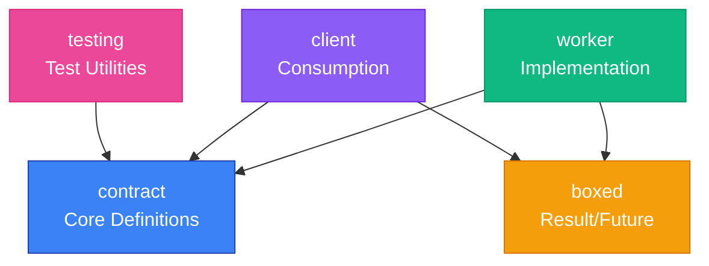

# API Reference

temporal-contract is organized into focused packages, each serving a specific purpose in building type-safe Temporal workflows.

## Package Architecture



## Packages Overview

### [@temporal-contract/contract](/api/contract)

**Core contract definition and type utilities**

- `defineContract()` - Define type-safe workflow contracts
- Type inference utilities
- Contract composition helpers

```bash
pnpm add @temporal-contract/contract
```

### [@temporal-contract/worker](/api/worker)

**Type-safe worker implementation (uses @swan-io/boxed for activities)**

- `declareActivitiesHandler()` - Implement activities with Result/Future pattern
- `declareWorkflow()` - Implement workflows with typed context
- Automatic input/output validation
- Activities use @swan-io/boxed, workflows use @temporal-contract/boxed

```bash
pnpm add @temporal-contract/worker @swan-io/boxed @temporal-contract/boxed
```

### [@temporal-contract/worker-nestjs](/api/worker-nestjs)

**NestJS integration for type-safe workers with dependency injection**

- `TemporalModule` - Configure workers with NestJS DI
- Full support for NestJS services in activities
- Automatic worker lifecycle management

```bash
pnpm add @temporal-contract/worker-nestjs @swan-io/boxed
```

### [@temporal-contract/client](/api/client)

**Type-safe client for executing workflows (uses @swan-io/boxed)**

- `TypedClient.create()` - Create type-safe workflow client
- Full type inference from contract
- Returns `Future<Result<T, E>>` for explicit error handling
- Type-safe workflow execution

```bash
pnpm add @temporal-contract/client @swan-io/boxed
```

### [@temporal-contract/boxed](/api/boxed)

**Temporal-compatible Result and Future types for workflows**

- `Result<T, E>` - Explicit success/error handling
- `Future<T>` - Async operations with Results
- Temporal-compatible for deterministic execution
- Same API as @swan-io/boxed

::: tip Package Usage
- Use **@swan-io/boxed** for activities and clients (better performance)
- Use **@temporal-contract/boxed** for workflows (Temporal-compatible)
:::

```bash
pnpm add @temporal-contract/boxed
```

### [@temporal-contract/testing](/api/testing)

**Testing utilities for workflows and activities**

- Testcontainers integration for Temporal server
- Vitest extension with `clientConnection` and `workerConnection`
- Global setup for test lifecycle
- Type-safe testing helpers

```bash
pnpm add -D @temporal-contract/testing
```

## Quick Reference

### Contract Definition

```typescript
import { defineContract } from '@temporal-contract/contract';
import { z } from 'zod';

const contract = defineContract({
  taskQueue: 'my-queue',

  // Global activities
  activities: {
    sendEmail: {
      input: z.object({ to: z.string(), body: z.string() }),
      output: z.object({ sent: z.boolean() })
    }
  },

  // Workflows
  workflows: {
    processOrder: {
      input: z.object({ orderId: z.string() }),
      output: z.object({ success: z.boolean() }),

      // Workflow-specific activities
      activities: {
        validateOrder: {
          input: z.object({ orderId: z.string() }),
          output: z.object({ valid: z.boolean() })
        }
      }
    }
  }
});
```

### Activity Implementation

```typescript
import { declareActivitiesHandler, ActivityError } from '@temporal-contract/worker/activity';
import { Future, Result } from '@swan-io/boxed';

const handler = declareActivitiesHandler({
  contract,
  activities: {
    sendEmail: ({ to, body }) =>
      Future.fromPromise(emailService.send({ to, body }))
        .mapError((error) =>
          new ActivityError('EMAIL_FAILED', 'Failed to send email', error)
        )
        .mapOk(() => ({ sent: true })),
    validateOrder: ({ orderId }) =>
      Future.value(Result.Ok({ valid: true }))
  }
});
```

### Workflow Implementation

```typescript
import { declareWorkflow } from '@temporal-contract/worker/workflow';

export const processOrder = declareWorkflow({
  workflowName: 'processOrder',
  contract,
  implementation: async ({ activities }, { orderId }) => {
    // Activities return plain values (Result is unwrapped by the framework)
    const { valid } = await activities.validateOrder({ orderId });
    
    await activities.sendEmail({
      to: 'admin@example.com',
      body: 'Order processed'
    });
    
    // Return plain object (not Result - network serialization)
    return { success: valid };
  }
});
```

### Worker Setup

```typescript
import { Worker } from '@temporalio/worker';
import { handler } from './activities';

const worker = await Worker.create({
  workflowsPath: require.resolve('./workflows'),
  activities: handler.activities,
  taskQueue: handler.contract.taskQueue
});

await worker.run();
```

### Client Usage

```typescript
import { TypedClient } from '@temporal-contract/client';
import { Connection, Client } from '@temporalio/client';

const connection = await Connection.connect({
  address: 'localhost:7233'
});

const temporalClient = new Client({ connection });
const client = TypedClient.create(contract, temporalClient);

// Execute workflow
const result = await client.executeWorkflow('processOrder', {
  workflowId: 'order-123',
  args: { orderId: 'ORD-123' }
});

// Handle result
result.match({
  Ok: (output) => console.log('Success:', output),
  Error: (error) => console.error('Failed:', error)
});
```

## Type Utilities

### Contract Types

```typescript
import type { Contract, WorkflowDefinition } from '@temporal-contract/contract';

// Extract contract type
type MyContract = typeof contract;

// Extract workflow definition
type OrderWorkflow = MyContract['workflows']['processOrder'];
```

### Inferred Types

```typescript
import type { InferInput, InferOutput } from '@temporal-contract/contract';

// Infer input type from workflow
type OrderInput = InferInput<typeof contract, 'processOrder'>;

// Infer output type from workflow
type OrderOutput = InferOutput<typeof contract, 'processOrder'>;
```

## Error Handling

### Result Pattern

```typescript
import { TypedClient } from '@temporal-contract/client';
import { Result } from '@swan-io/boxed';

// Client returns Result<T, E>
const result = await client.executeWorkflow('processOrder', {
  workflowId: 'order-123',
  args: { orderId: 'ORD-123' }
});

// Handle with match
result.match({
  Ok: (output) => {
    console.log('Success:', output);
  },
  Error: (error) => {
    console.error('Failed:', error);
  }
});

// Or check manually
if (result.isOk()) {
  console.log('Success:', result.get());
} else {
  console.error('Failed:', result.getError());
}
```

## See Also

- [Getting Started Guide](/guide/getting-started)
- [Core Concepts](/guide/core-concepts)
- [Examples](/examples/)
