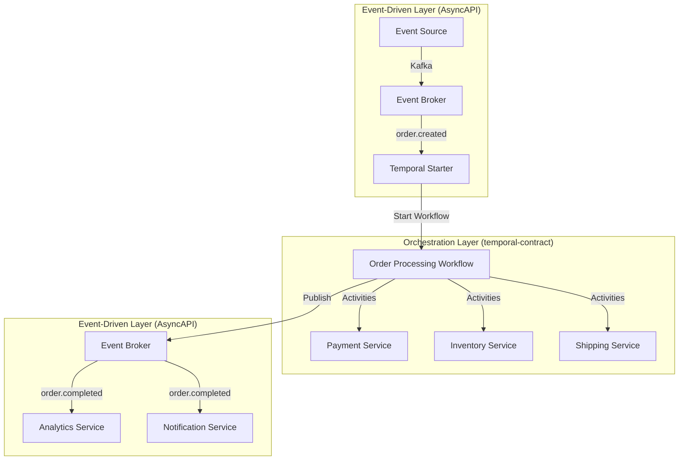

# AsyncAPI Compatibility

This guide explores the relationship between temporal-contract and the AsyncAPI specification, analyzing their compatibility and complementary use cases.

## Overview

**Question**: Is temporal-contract compatible with AsyncAPI spec? Can Temporal.io be described through an AsyncAPI contract?

**Short Answer**: While temporal-contract and AsyncAPI both define APIs for distributed systems, they serve fundamentally different architectural patterns and are not directly compatible. However, they can complement each other in a broader system architecture.

## What is AsyncAPI?

[AsyncAPI](https://www.asyncapi.com/) is a specification for describing and documenting **asynchronous, message-driven APIs** in event-driven architectures. It's analogous to OpenAPI (Swagger) but for event-based systems.

### AsyncAPI Use Cases

- **Event-Driven Architectures**: Services communicate by publishing and consuming events through message brokers (Kafka, RabbitMQ, MQTT)
- **Message-Driven Systems**: Asynchronous communication patterns with topics, queues, and channels
- **API Documentation**: Human and machine-readable documentation for event-based APIs
- **Code Generation**: Tools to generate clients, servers, and documentation from AsyncAPI specs

### AsyncAPI Key Concepts

```yaml
# Example AsyncAPI 3.0 specification
asyncapi: 3.0.0
info:
  title: Order Events API
  version: 1.0.0
channels:
  orderCreated:
    address: orders/created
    messages:
      OrderCreated:
        payload:
          type: object
          properties:
            orderId:
              type: string
            customerId:
              type: string
operations:
  publishOrderCreated:
    action: send
    channel:
      $ref: '#/channels/orderCreated'
```

**Characteristics**:

- **Decentralized choreography**: Services react to events independently
- **Message-oriented**: Communication via channels, topics, and queues
- **Protocol-agnostic**: Supports Kafka, AMQP, MQTT, WebSockets, etc.
- **Event documentation**: Describes message schemas and communication patterns

## What is temporal-contract?

temporal-contract is a **type-safe contract system for Temporal.io**, a durable workflow orchestration engine. It provides:

- **Workflow Orchestration**: Centralized coordination of multi-step business processes
- **Type Safety**: End-to-end TypeScript types from contracts to implementations
- **Automatic Validation**: Runtime validation using schemas (Zod, Valibot, etc.)
- **Durable Execution**: Workflows survive failures and resume exactly where they left off

### temporal-contract Key Concepts

```typescript
// Example temporal-contract definition
export const orderContract = defineContract({
  taskQueue: 'orders',
  workflows: {
    processOrder: {
      input: z.object({ orderId: z.string() }),
      output: z.object({ success: z.boolean() }),
      activities: {
        processPayment: {
          input: z.object({ amount: z.number() }),
          output: z.object({ transactionId: z.string() })
        },
        reserveInventory: {
          input: z.object({ items: z.array(itemSchema) }),
          output: z.object({ reservationId: z.string() })
        }
      }
    }
  }
});
```

**Characteristics**:

- **Centralized orchestration**: Workflows explicitly coordinate task execution
- **RPC-style**: Activities are invoked as function calls by workflows
- **State management**: Temporal maintains workflow state durably
- **Execution guarantees**: Automatic retries, timeouts, and recovery

## Fundamental Differences

### Architectural Patterns

| Aspect              | AsyncAPI (Event-Driven)            | temporal-contract (Orchestration)    |
| ------------------- | ---------------------------------- | ------------------------------------ |
| **Communication**   | Publish/Subscribe, Fire-and-forget | Request/Response, Orchestrated calls |
| **Coordination**    | Implicit (choreography)            | Explicit (orchestration)             |
| **State**           | Distributed across services        | Centralized in workflow state        |
| **Execution Model** | Reactive to events                 | Imperative workflow logic            |
| **Error Handling**  | Manual, per-service                | Automatic retries, compensations     |
| **Use Case**        | Loose coupling, events             | Complex multi-step processes         |

### Protocol Layer

- **AsyncAPI** describes **message protocols** and **event schemas** for asynchronous communication over brokers
- **temporal-contract** describes **workflow interfaces** and **activity APIs** for durable orchestration via Temporal's gRPC-based protocol

These operate at different abstraction levels and serve different purposes.

## Why They're Not Directly Compatible

1. **Different Communication Patterns**
   - AsyncAPI: Event-driven, publish-subscribe
   - Temporal: RPC-based activity invocations within workflows

2. **Different State Management**
   - AsyncAPI: Services maintain their own state, react to events
   - Temporal: Workflow state is centrally managed and persisted

3. **Different Semantics**
   - AsyncAPI: Describes asynchronous messages flowing through channels
   - temporal-contract: Describes synchronous activity calls orchestrated by workflows

4. **Different Purposes**
   - AsyncAPI: Document event-based APIs for inter-service communication
   - temporal-contract: Define type-safe contracts for durable workflow execution

## Complementary Use Cases

While not compatible, they can work together in a larger architecture:

### Example: Hybrid Architecture



### Scenario: Order Processing System

1. **AsyncAPI for Event Ingestion**

   ```yaml
   # AsyncAPI 3.0 describes incoming order events
   channels:
     orderCreated:
       address: orders/created
       messages:
         OrderCreated:
           payload:
             type: object
             properties:
               orderId:
                 type: string
               customerId:
                 type: string
   operations:
     receiveOrderCreated:
       action: receive
       channel:
         $ref: '#/channels/orderCreated'
   ```

2. **temporal-contract for Orchestration**

   ```typescript
   // temporal-contract orchestrates order processing
   export const orderContract = defineContract({
     taskQueue: 'orders',
     workflows: {
       processOrder: {
         input: z.object({ orderId: z.string() }),
         output: z.object({ success: z.boolean() }),
         activities: {
           processPayment: {
             input: z.object({ amount: z.number() }),
             output: z.object({ transactionId: z.string() })
           },
           reserveInventory: {
             input: z.object({ items: z.array(itemSchema) }),
             output: z.object({ reservationId: z.string() })
           },
           createShipment: {
             input: z.object({ orderId: z.string() }),
             output: z.object({ trackingNumber: z.string() })
           }
         }
       }
     }
   });
   ```

3. **AsyncAPI for Event Output**

   ```yaml
   # AsyncAPI 3.0 describes outgoing completion events
   channels:
     orderCompleted:
       address: orders/completed
       messages:
         OrderCompleted:
           payload:
             type: object
             properties:
               orderId:
                 type: string
               status:
                 type: string
   operations:
     publishOrderCompleted:
       action: send
       channel:
         $ref: '#/channels/orderCompleted'
   ```

**In this architecture**:

- Events trigger workflow execution (AsyncAPI → Temporal)
- Workflows orchestrate complex business logic (temporal-contract)
- Workflows publish completion events (Temporal → AsyncAPI)

## When to Use Each

### Use AsyncAPI When:

- Building loosely-coupled microservices
- Need protocol-agnostic event documentation
- Implementing reactive, event-driven patterns
- Services need to independently react to events
- Communication is primarily one-way (notifications, updates)

### Use temporal-contract When:

- Orchestrating complex, multi-step business processes
- Need reliable execution with automatic retries
- Require durable state management
- Building workflows with long-running operations
- Need strong consistency and transactional semantics
- Implementing sagas, batch jobs, or approval workflows

### Use Both When:

- Building large-scale distributed systems
- Events trigger orchestrated workflows
- Workflows publish domain events
- Need both loose coupling (events) and coordinated processes (workflows)

## Mapping Concepts

While not directly compatible, here's how concepts loosely relate:

| AsyncAPI            | temporal-contract      | Notes                                                                  |
| ------------------- | ---------------------- | ---------------------------------------------------------------------- |
| Channel             | Task Queue             | Fundamentally different: pub/sub messaging vs work distribution queues |
| Message             | Activity Input/Output  | Messages are events; activities are RPC calls                          |
| Subscribe Operation | Workflow Trigger       | Events can trigger workflow execution                                  |
| Publish Operation   | Activity side-effect   | Workflows can publish events as side effects                           |
| Payload Schema      | Zod/Schema definitions | Both use schemas for validation                                        |

## Theoretical AsyncAPI Generation

While direct compatibility isn't feasible, you could theoretically generate AsyncAPI specs for:

### 1. Workflow Execution Events

```yaml
# Hypothetical: Document Temporal's internal event system
channels:
  workflowStarted:
    address: temporal/workflow/started
    messages:
      WorkflowStarted:
        payload:
          workflowId: string
          workflowType: string
```

**Limitation**: This describes Temporal's internal events, not the workflow business logic.

### 2. Activity Patterns as Async Operations

```yaml
# Hypothetical: Represent activities as async operations
operations:
  processPayment:
    action: send
    channel: activities/processPayment
```

**Limitation**: Activities aren't truly async message operations; they're orchestrated RPC calls.

## Conclusion

**temporal-contract and AsyncAPI are not compatible** because they address different architectural patterns:

- **AsyncAPI**: For event-driven architectures with asynchronous messaging
- **temporal-contract**: For workflow orchestration with durable execution

**However**, they complement each other beautifully:

- Use AsyncAPI to document event-driven communication between services
- Use temporal-contract to define and implement complex, reliable workflows
- Combine both: events trigger workflows, workflows publish events

Think of AsyncAPI as defining the nervous system (events and reactions) while temporal-contract defines the brain (coordination and decision-making) of your distributed system.

## Further Reading

- [AsyncAPI Specification](https://www.asyncapi.com/docs/reference/specification/v3.0.0)
- [Temporal.io Documentation](https://docs.temporal.io/)
- [Event-Driven vs Orchestration](https://docs.temporal.io/concepts)
- [temporal-contract Core Concepts](/guide/core-concepts)

---

**Want to discuss this further?** [Open an issue on GitHub](https://github.com/btravers/temporal-contract/issues)
