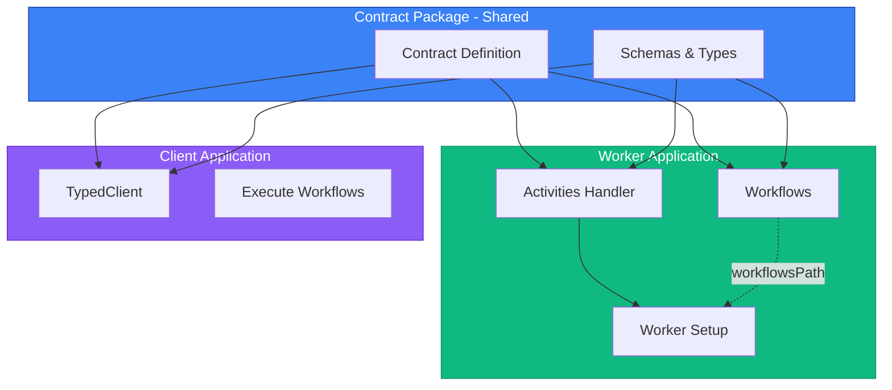

# Entry Points Architecture

Understanding how temporal-contract handles the separation between activities and workflows.

## Why Separate Entry Points?

Temporal requires workflows to be loaded via `workflowsPath` for sandboxing and determinism. This architectural decision means:

1. **Activities** are loaded directly into the Worker
2. **Workflows** are loaded from a separate file path

temporal-contract respects this architecture while providing type safety across both.

## Architecture Overview



## File Structure

Recommended project structure with separate contract package:

```
contract-package/           # Shared contract package
├── src/
│   ├── contract.ts        # Contract definition
│   ├── schemas.ts         # Domain schemas
│   └── index.ts          # Package exports
└── package.json          # Package configuration

worker-application/        # Worker implementation
├── src/
│   ├── activities/
│   │   └── index.ts      # Activities handler
│   ├── workflows/
│   │   └── order.workflow.ts  # Workflow implementations
│   └── worker.ts         # Worker setup
└── package.json          # Imports contract-package

client-application/        # Client (can be separate app)
├── src/
│   └── client.ts         # Client code
└── package.json          # Imports contract-package
```

## Contract Definition

Define your contract in a separate package that can be shared:

```typescript
// contract-package/src/contract.ts
import { defineContract } from '@temporal-contract/contract';
import { z } from 'zod';

export const orderContract = defineContract({
  taskQueue: 'orders',

  activities: {
    sendEmail: {
      input: z.object({ to: z.string(), body: z.string() }),
      output: z.object({ sent: z.boolean() })
    }
  },

  workflows: {
    processOrder: {
      input: z.object({ orderId: z.string() }),
      output: z.object({ success: z.boolean() }),
      activities: {
        processPayment: {
          input: z.object({ amount: z.number() }),
          output: z.object({ transactionId: z.string() })
        }
      }
    }
  }
});
```

```typescript
// contract-package/src/index.ts
export { orderContract } from './contract.js';
// Export schemas and types as needed
```

## Activities Entry Point

Create a single activities handler in your worker application:

```typescript
// worker-application/src/activities/index.ts
import { declareActivitiesHandler } from '@temporal-contract/worker/activity';
import { orderContract } from 'contract-package';

export const activities = declareActivitiesHandler({
  contract: orderContract,
  activities: {
    sendEmail: async ({ to, body }) => {
      await emailService.send({ to, body });
      return { sent: true };
    },
    processPayment: async ({ amount }) => {
      const txId = await paymentGateway.charge(amount);
      return { transactionId: txId };
    }
  }
});
```

## Workflows Entry Point

Create separate workflow files in your worker application:

```typescript
// worker-application/src/workflows/order.workflow.ts
import { declareWorkflow } from '@temporal-contract/worker/workflow';
import { orderContract } from 'contract-package';

export const processOrder = declareWorkflow({
  workflowName: 'processOrder',
  contract: orderContract,
  implementation: async (context, { orderId }) => {
    const payment = await context.activities.processPayment({
      amount: 100
    });

    await context.activities.sendEmail({
      to: 'customer@example.com',
      body: `Order ${orderId} processed`
    });

    return { success: true };
  }
});
```

## Worker Setup

Wire everything together in your worker application:

```typescript
// worker-application/src/worker.ts
import { Worker } from '@temporalio/worker';
import { activities } from './activities';

const worker = await Worker.create({
  // Workflows loaded from path (Temporal requirement)
  workflowsPath: require.resolve('./workflows/order.workflow'),

  // Activities loaded directly
  activities: activities.activities,

  // Task queue from contract
  taskQueue: activities.contract.taskQueue,
});

await worker.run();
```

## Client Application

Use the contract in a separate client application (can be in a different codebase):

```typescript
// client-application/src/client.ts
import { Connection } from '@temporalio/client';
import { TypedClient } from '@temporal-contract/client';
import { orderContract } from 'contract-package';

// Connect to Temporal server
const connection = await Connection.connect({
  address: 'localhost:7233',
});

// Create type-safe client from contract
const client = TypedClient.create(orderContract, {
  connection,
  namespace: 'default',
});

// Start workflow with full type safety
const handle = await client.startWorkflow('processOrder', {
  workflowId: 'order-123',
  args: { orderId: 'ORD-123' }  // ✅ Type-checked!
});

// Wait for result (also type-checked)
const result = await handle.result();
console.log(result.success);  // ✅ TypeScript knows the shape
```

## Multiple Workflows

For multiple workflows, export them all from a single file:

```typescript
// workflows/index.ts
export * from './order.workflow';
export * from './shipment.workflow';
export * from './refund.workflow';
```

```typescript
// worker.ts
const worker = await Worker.create({
  workflowsPath: require.resolve('./workflows'),
  activities: activities.activities,
  taskQueue: activities.contract.taskQueue,
});
```

## Type Safety Across Boundaries

Despite the separation, type safety is maintained:

### From Contract to Activities

```typescript
// Contract defines the shape
const contract = defineContract({
  activities: {
    processPayment: {
      input: z.object({ amount: z.number() }),
      output: z.object({ transactionId: z.string() })
    }
  }
});

// Activities handler must match
declareActivitiesHandler({
  contract,
  activities: {
    processPayment: async ({ amount }) => {
      // ✅ amount is number
      return { transactionId: 'TXN-123' };
      // ✅ Must return { transactionId: string }
    }
  }
});
```

### From Contract to Workflows

```typescript
// Workflow context is typed from contract
declareWorkflow({
  workflowName: 'processOrder',
  contract,
  implementation: async (context, input) => {
    // ✅ TypeScript knows processPayment exists
    const result = await context.activities.processPayment({
      amount: 100  // ✅ Type checked
    });

    // ✅ result.transactionId is string
    console.log(result.transactionId);
  }
});
```

## Benefits of This Architecture

### 1. Contract Reusability

The contract package can be imported by multiple applications:

- Worker application (to implement)
- Client applications (to consume)
- Even other services that need the type definitions

### 2. Type Safety

Full TypeScript inference across all boundaries and applications.

### 3. Validation

Automatic validation at:

- Workflow entry/exit
- Activity calls
- Client requests

### 4. Temporal Compliance

Respects Temporal's architecture requirements.

### 5. Independent Deployment

- Contract package can be versioned independently
- Client applications can be in different codebases
- Workers and clients can be deployed separately

### 6. Testability

Activities and workflows can be tested independently:

```typescript
// Test activities directly
const result = await activities.activities.processPayment({
  amount: 100
});

// Test workflows with mock context
const workflow = processOrder.implementation;
const mockContext = createMockContext();
await workflow(mockContext, { orderId: 'ORD-123' });
```

### 7. Organization

Clear separation of concerns:

- Contract package: API definition
- Worker application: Implementation
- Client application: Consumption

## Common Patterns

### Pattern 1: Shared Activities

```typescript
// activities/shared.ts
export const sharedActivities = {
  sendEmail: async ({ to, body }) => ({ sent: true }),
  logEvent: async ({ event }) => ({ logged: true })
};

// activities/order.ts
import { sharedActivities } from './shared';

export const orderActivities = declareActivitiesHandler({
  contract: orderContract,
  activities: {
    ...sharedActivities,
    processPayment: async ({ amount }) => ({ transactionId: 'TXN' })
  }
});
```

### Pattern 2: Activity Composition

```typescript
// activities/index.ts
const baseActivities = {
  validateInput: async ({ data }) => ({ valid: true })
};

const paymentActivities = {
  processPayment: async ({ amount }) => ({ transactionId: 'TXN' })
};

export const activities = declareActivitiesHandler({
  contract: orderContract,
  activities: {
    ...baseActivities,
    ...paymentActivities
  }
});
```

## See Also

- [Worker Implementation](/guide/worker-implementation)
- [Activity Handler Types](/guide/activity-handlers)
- [Getting Started](/guide/getting-started)
