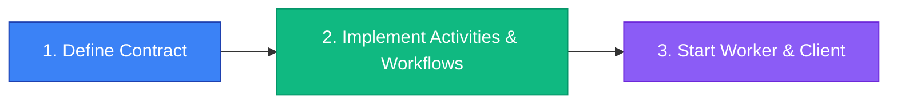

# Getting Started

Welcome to **temporal-contract**! This guide will help you get up and running with type-safe Temporal workflows.

## What is temporal-contract?

**temporal-contract** is a TypeScript library that brings end-to-end type safety and automatic validation to [Temporal.io](https://temporal.io/) workflows and activities. It uses a contract-first approach with Zod schemas to ensure your workflows are type-safe from definition to execution.

## Why Use temporal-contract?

### The Problem

Working with Temporal.io is powerful, but comes with challenges:

- **No type safety** — Workflow parameters and return types are loosely typed
- **Manual validation** — You need to validate inputs and outputs manually
- **Runtime errors** — Type mismatches are only caught at runtime
- **Scattered definitions** — Activity types are defined separately from workflows

### The Solution

temporal-contract solves these problems by:

- ✅ **End-to-end type safety** — From contract to client, workflows, and activities
- ✅ **Automatic validation** — Zod schemas validate at all network boundaries
- ✅ **Compile-time checks** — TypeScript catches issues before runtime
- ✅ **Better DX** — Autocomplete, refactoring support, inline documentation

## Installation

Install the required packages:

::: code-group

```bash [pnpm]
pnpm add @temporal-contract/contract @temporal-contract/worker @temporal-contract/client
pnpm add zod @temporalio/client @temporalio/worker @temporalio/workflow
```

```bash [npm]
npm install @temporal-contract/contract @temporal-contract/worker @temporal-contract/client
npm install zod @temporalio/client @temporalio/worker @temporalio/workflow
```

```bash [yarn]
yarn add @temporal-contract/contract @temporal-contract/worker @temporal-contract/client
yarn add zod @temporalio/client @temporalio/worker @temporalio/workflow
```

:::

## Quick Start

Let's build a simple order processing workflow in 3 steps.



### 1. Define Your Contract

Create a contract that defines your workflow's interface:

```typescript
// contract.ts
import { defineContract } from '@temporal-contract/contract';
import { z } from 'zod';

export const orderContract = defineContract({
  taskQueue: 'orders',

  // Global activities available to all workflows
  activities: {
    sendEmail: {
      input: z.object({
        to: z.string().email(),
        subject: z.string(),
        body: z.string()
      }),
      output: z.object({ sent: z.boolean() }),
    },
  },

  workflows: {
    processOrder: {
      input: z.object({
        orderId: z.string(),
        customerId: z.string()
      }),
      output: z.object({
        status: z.enum(['success', 'failed']),
        transactionId: z.string()
      }),

      // Workflow-specific activities
      activities: {
        processPayment: {
          input: z.object({
            customerId: z.string(),
            amount: z.number().positive()
          }),
          output: z.object({
            transactionId: z.string(),
            success: z.boolean()
          }),
        },
      },
    },
  },
});
```

### 2. Implement Activities & Workflows

Implement your activities and workflows with full type safety:

```typescript
// activities.ts
import { declareActivitiesHandler } from '@temporal-contract/worker/activity';
import { orderContract } from './contract';

export const activities = declareActivitiesHandler({
  contract: orderContract,
  activities: {
    sendEmail: async ({ to, subject, body }) => {
      // Full type safety - parameters are automatically typed!
      await emailService.send({ to, subject, body });
      return { sent: true };
    },
    processPayment: async ({ customerId, amount }) => {
      // TypeScript knows the exact types
      const txId = await paymentGateway.charge(customerId, amount);
      return { transactionId: txId, success: true };
    },
  },
});
```

```typescript
// workflows.ts
import { declareWorkflow } from '@temporal-contract/worker/workflow';
import { orderContract } from './contract';

export const processOrder = declareWorkflow({
  workflowName: 'processOrder',
  contract: orderContract,
  implementation: async (context, { orderId, customerId }) => {
    // Full autocomplete for activities and their parameters
    const payment = await context.activities.processPayment({
      customerId,
      amount: 100
    });

    await context.activities.sendEmail({
      to: customerId,
      subject: 'Order Confirmed',
      body: `Order ${orderId} processed`,
    });

    return {
      status: payment.success ? 'success' : 'failed',
      transactionId: payment.transactionId,
    };
  },
});
```

### 3. Start Worker & Call from Client

Set up your worker and client:

```typescript
// worker.ts
import { Worker } from '@temporalio/worker';
import { activities } from './activities';

const worker = await Worker.create({
  workflowsPath: require.resolve('./workflows'),
  activities: activities.activities,
  taskQueue: activities.contract.taskQueue,
});

await worker.run();
```

```typescript
// client.ts
import { TypedClient } from '@temporal-contract/client';
import { Connection } from '@temporalio/client';
import { orderContract } from './contract';

const connection = await Connection.connect({
  address: 'localhost:7233'
});

const client = TypedClient.create(orderContract, { connection });

// Fully typed workflow execution
const result = await client.executeWorkflow('processOrder', {
  workflowId: 'order-123',
  args: { orderId: 'ORD-123', customerId: 'CUST-456' },
});

console.log(result.status);  // 'success' | 'failed' — fully typed!
```

## What's Next?

- 📚 Learn about [Core Concepts](/guide/core-concepts)
- 🔨 Explore [Worker Implementation](/guide/worker-implementation)
- 📖 Check out [Examples](/examples/)
- 🔍 Browse the [API Reference](/api/)
