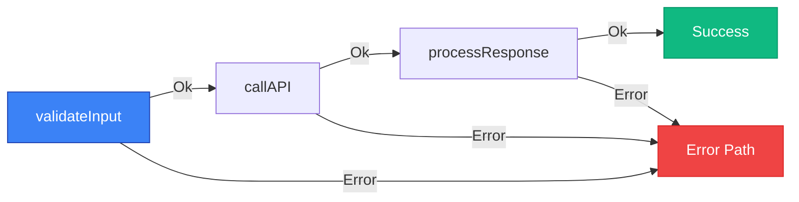

# Result Pattern

Learn how to use explicit error handling with the Result/Future pattern.

## Overview

temporal-contract uses the Result/Future pattern for explicit error handling. The implementation differs between activities and workflows:

- **Activities and Clients**: Use **[@swan-io/boxed](https://github.com/swan-io/boxed)** - a battle-tested library with excellent performance
- **Workflows**: Use **@temporal-contract/boxed** - a Temporal-compatible implementation required for deterministic execution

Both packages provide the same API, making it easy to work with both.

```mermaid
graph LR
    A[Activities] -->|@swan-io/boxed| B[Result/Future]
    C[Workflows] -->|@temporal-contract/boxed| B
    D[Clients] -->|@swan-io/boxed| B

    style A fill:#10b981,stroke:#059669,color:#fff
    style C fill:#3b82f6,stroke:#1e40af,color:#fff
    style D fill:#8b5cf6,stroke:#6d28d9,color:#fff
```

## Installation

```bash
# For activities and clients
pnpm add @swan-io/boxed

# For workflows (Temporal-compatible)
pnpm add @temporal-contract/boxed
```

## Basic Usage

### Activities (using @swan-io/boxed)

Activities use `@swan-io/boxed` for excellent performance and ecosystem compatibility:

```typescript
import { declareActivitiesHandler, ActivityError } from '@temporal-contract/worker/activity';
import { Future, Result } from '@swan-io/boxed';
import { orderContract } from './contract';

export const activities = declareActivitiesHandler({
  contract: orderContract,
  activities: {
    processPayment: ({ amount }) => {
      return Future.fromPromise(paymentGateway.charge(amount))
        .mapError(error =>
          new ActivityError(
            'PAYMENT_FAILED',
            error instanceof Error ? error.message : 'Payment failed',
            error
          )
        )
        .mapOk(txId => ({ transactionId: txId, success: true }));
    },

    sendEmail: ({ to, body }) => {
      return Future.fromPromise(emailService.send({ to, body }))
        .mapError(error =>
          new ActivityError(
            'EMAIL_FAILED',
            error instanceof Error ? error.message : 'Email failed',
            error
          )
        )
        .mapOk(() => ({ sent: true }));
    }
  }
});
```

### Workflows (using @temporal-contract/boxed)

Workflows require `@temporal-contract/boxed` for Temporal's deterministic execution:

```typescript
import { declareWorkflow } from '@temporal-contract/worker/workflow';
import { Result } from '@temporal-contract/boxed';
import { orderContract } from './contract';

export const processOrder = declareWorkflow({
  workflowName: 'processOrder',
  contract: orderContract,
  implementation: async ({ activities }, { orderId, amount }) => {
    // Process payment - activities return plain values
    const payment = await activities.processPayment({ amount });

    // Send confirmation email
    await activities.sendEmail({
      to: 'customer@example.com',
      body: `Order ${orderId} confirmed`
    });

    return {
      success: true,
      transactionId: payment.transactionId
    };
  }
});
```

### Clients (using @swan-io/boxed)

Clients use `@swan-io/boxed` to handle workflow results:

```typescript
import { TypedClient } from '@temporal-contract/client';
import { Result } from '@swan-io/boxed';
import { Client } from '@temporalio/client';
import { orderContract } from './contract';

const temporalClient = new Client({ connection });

const client = TypedClient.create(orderContract, temporalClient);
const result = await client.executeWorkflow('processOrder', {
  workflowId: 'order-123',
  args: { orderId: 'ORD-123', amount: 100 },
});

// Handle result with pattern matching
result.match({
  Ok: (value) => {
    console.log('Order processed:', value.transactionId);
  },
  Error: (error) => {
    console.error('Order failed:', error);
  },
});
```

## Why Two Packages?

### @swan-io/boxed (Activities & Clients)

- ✅ Battle-tested with extensive usage
- ✅ Excellent performance optimizations
- ✅ Large ecosystem support
- ✅ Works perfectly outside of Temporal workflows

### @temporal-contract/boxed (Workflows)

- ✅ Temporal deterministic execution compatible
- ✅ Same API as @swan-io/boxed
- ✅ Designed specifically for workflow constraints
- ✅ Seamless interoperability with @swan-io/boxed

## Interoperability

Both packages share the same API surface, so code is portable:

```typescript
// Same API for both packages!
const result = Result.Ok(42);
const future = Future.value(42);

result.match({
  Ok: (value) => console.log(value),
  Error: (error) => console.error(error),
});
```

For explicit conversion between the two (rarely needed), see the [@temporal-contract/boxed interop documentation](/api/boxed#interoperability).

## Pattern Matching

Activities return plain values when called from workflows. If an activity fails, it will throw an error:

```typescript
export const processOrder = declareWorkflow({
  workflowName: 'processOrder',
  contract: orderContract,
  implementation: async ({ activities }, input) => {
    try {
      // Activity returns plain value (Result is unwrapped internally)
      const payment = await activities.processPayment({ amount: 100 });
      console.log('Payment succeeded:', payment.transactionId);

      return { success: true, transactionId: payment.transactionId };
    } catch (error) {
      // Activity errors are thrown
      console.error('Payment failed:', error);
      return { success: false, transactionId: '' };
    }
  }
});
```

Note: For child workflows, you do get Result objects. See the Child Workflows section below.

## Chaining Activities

When calling multiple activities, use standard async/await with try/catch:

```typescript
export const processOrder = declareWorkflow({
  workflowName: 'processOrder',
  contract: orderContract,
  implementation: async ({ activities }, input) => {
    try {
      // Activities return plain values
      const payment = await activities.processPayment({ amount: 100 });

      // Next activity only runs if payment succeeded
      await activities.sendEmail({
        to: 'customer@example.com',
        body: `Payment ${payment.transactionId} processed`
      });

      // Update database
      await activities.updateDatabase({
        status: 'completed'
      });

      return { success: true };
    } catch (error) {
      console.error('Workflow failed:', error);
      return { success: false };
    }
  }
});
```

## Error Types

Define typed errors in your activities:

```typescript
type PaymentError =
  | { type: 'InsufficientFunds' }
  | { type: 'CardDeclined' }
  | { type: 'NetworkError', message: string };

type EmailError =
  | { type: 'InvalidEmail' }
  | { type: 'ServiceUnavailable' };

// Activities return Future with typed errors
processPayment: ({ amount }) => {
  return Future.fromPromise(paymentGateway.charge(amount))
    .mapError<ActivityError>(error => {
      // Wrap domain errors in ActivityError for Temporal retry policies
      return new ActivityError(
        'PAYMENT_FAILED',
        error instanceof Error ? error.message : 'Payment failed',
        error
      );
    })
    .mapOk((txId) => ({ transactionId: txId }));
}
```

## Benefits

### 1. Explicit Error Handling

Activities use the Result pattern internally, while workflows use try/catch:

```typescript
// Activity implementation (uses Result pattern)
const processPayment = ({ amount }) => {
  return Future.fromPromise(paymentGateway.charge(amount))
    .mapError((error) =>
      new ActivityError('PAYMENT_FAILED', 'Payment failed', error)
    )
    .mapOk((txId) => ({ transactionId: txId }));
};

// Workflow (uses standard try/catch for activities)
export const processOrder = declareWorkflow({
  workflowName: 'processOrder',
  contract: myContract,
  implementation: async ({ activities }, input) => {
    try {
      // Activity returns plain value
      const payment = await activities.processPayment({ amount: 100 });
      return { success: true, transactionId: payment.transactionId };
    } catch (error) {
      // Handle activity error
      return { success: false };
    }
  }
});
```

### 2. No Hidden Exceptions in Activities

Activities explicitly return Results instead of throwing:

```typescript
// ✅ Clear - activity returns Future<Result>
const processPayment = ({ amount }) => {
  return Future.fromPromise(paymentGateway.charge(amount))
    .mapError((error) =>
      new ActivityError('PAYMENT_FAILED', 'Payment failed', error)
    )
    .mapOk((txId) => ({ transactionId: txId }));
};

// ❌ Unclear - might throw anything
async function processPayment({ amount }) {
  const txId = await paymentGateway.charge(amount);
  return { transactionId: txId };
}
```

### 3. Railway-Oriented Programming (Activities)

Activity implementations can chain operations that short-circuit on error:



```typescript
// Activity implementation with chaining
const processOrder = ({ orderId }) => {
  return validateOrderId(orderId)
    .flatMap((validId) => fetchOrder(validId))
    .flatMap((order) => processPayment(order))
    .flatMap((payment) => updateDatabase(payment))
    .mapError((error) =>
      new ActivityError('ORDER_FAILED', 'Order processing failed', error)
    );
  // Stops at first error
};
```

### 4. Partial Success Handling

Track partial success in complex workflows using try/catch blocks:

```typescript
export const processOrder = declareWorkflow({
  workflowName: 'processOrder',
  contract: orderContract,
  implementation: async ({ activities }, input) => {
    let paymentTransactionId: string | undefined;

    try {
      // Step 1: Process payment
      const payment = await activities.processPayment({ amount: input.amount });
      paymentTransactionId = payment.transactionId;

      // Step 2: Schedule shipment
      await activities.scheduleShipment({ orderId: input.orderId });

      return { success: true, transactionId: paymentTransactionId };
    } catch (error) {
      // Payment succeeded but shipment failed - can handle specially
      if (paymentTransactionId) {
        // Rollback payment
        await activities.refundPayment({ transactionId: paymentTransactionId });

        return {
          success: false,
          message: 'Shipment failed, payment refunded',
          completedSteps: { payment: paymentTransactionId }
        };
      }

      return { success: false, message: 'Payment failed' };
    }
  }
});
```

## Child Workflows

Child workflows use the same Future/Result pattern for consistent error handling:

### Execute and Wait

```typescript
import { declareWorkflow } from '@temporal-contract/worker/workflow';

export const parentWorkflow = declareWorkflow({
  workflowName: 'parentWorkflow',
  contract: myContract,
  implementation: async ({ executeChildWorkflow }, input) => {
    // Execute child workflow and wait for result
    const result = await executeChildWorkflow(myContract, 'processPayment', {
      workflowId: `payment-${input.orderId}`,
      args: { amount: input.totalAmount }
    });

    return result.match({
      Ok: (output) => Result.Ok({
        success: true,
        transactionId: output.transactionId
      }),
      Error: (error) => Result.Error({
        type: 'ChildWorkflowFailed',
        error
      }),
    });
  },
});
```

### Start Without Waiting

```typescript
export const parentWorkflow = declareWorkflow({
  workflowName: 'parentWorkflow',
  contract: myContract,
  implementation: async ({ startChildWorkflow }, input) => {
    // Start child workflow without waiting
    const handleResult = await startChildWorkflow(myContract, 'sendNotification', {
      workflowId: `notification-${input.orderId}`,
      args: { message: 'Order received' }
    });

    handleResult.match({
      Ok: async (handle) => {
        // Child started successfully
        // Can wait for result later if needed
        const result = await handle.result();
      },
      Error: (error) => {
        console.error('Failed to start child:', error);
      },
    });

    return Result.Ok({ success: true });
  },
});
```

### Cross-Contract Child Workflows

Invoke workflows from different contracts/workers:

```typescript
import { orderContract, notificationContract } from './contracts';

export const orderWorkflow = declareWorkflow({
  workflowName: 'processOrder',
  contract: orderContract,
  implementation: async ({ executeChildWorkflow }, input) => {
    // Child workflow from another contract
    const notifyResult = await executeChildWorkflow(
      notificationContract,
      'sendOrderConfirmation',
      {
        workflowId: `notify-${input.orderId}`,
        args: { orderId: input.orderId }
      }
    );

    return notifyResult.match({
      Ok: () => Result.Ok({ status: 'completed' }),
      Error: (error) => Result.Error({
        type: 'NotificationFailed',
        error
      }),
    });
  },
});
```

## When to Use

### Use Result/Future Pattern When:

- **In Activity Implementations**: Always use Future/Result pattern for explicit error handling
- **For Child Workflows**: Child workflows return Results for explicit error handling
- **For Type-Safe Errors**: When you need ActivityError with proper retry policies

### Use Standard async/await When:

- **In Workflow Logic**: Use try/catch when calling activities from workflows
- **For Simple Error Handling**: When standard exception handling is sufficient
- **For Deterministic Code**: Workflows must remain deterministic

## See Also

- [@temporal-contract/boxed API Reference](/api/boxed)
- [Order Processing Example](/examples/basic-order-processing)
- [Worker Implementation](/guide/worker-implementation)
