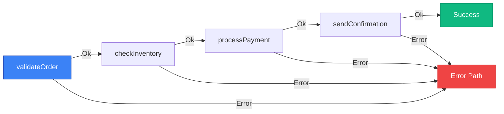

# Result Pattern

Learn how to use explicit error handling with the Result/Future pattern.

## Overview

temporal-contract uses the Result/Future pattern for explicit error handling. The implementation differs between activities and workflows:

- **Activities and Clients**: Use **[@swan-io/boxed](https://github.com/swan-io/boxed)** - a battle-tested library with excellent performance
- **Workflows**: Use **@temporal-contract/boxed** - a Temporal-compatible implementation required for deterministic execution

Both packages provide the same API, making it easy to work with both.

```mermaid
graph LR
    A[Activities] -->|@swan-io/boxed| B[Result/Future]
    C[Workflows] -->|@temporal-contract/boxed| B
    D[Clients] -->|@swan-io/boxed| B
    
    style A fill:#10b981,stroke:#059669,color:#fff
    style C fill:#3b82f6,stroke:#1e40af,color:#fff
    style D fill:#8b5cf6,stroke:#6d28d9,color:#fff
```

## Installation

```bash
# For activities and clients
pnpm add @swan-io/boxed

# For workflows (Temporal-compatible)
pnpm add @temporal-contract/boxed
```

## Basic Usage

### Activities (using @swan-io/boxed)

Activities use `@swan-io/boxed` for excellent performance and ecosystem compatibility:

```typescript
import { declareActivitiesHandler, ActivityError } from '@temporal-contract/worker/activity';
import { Future, Result } from '@swan-io/boxed';
import { orderContract } from './contract';

export const activities = declareActivitiesHandler({
  contract: orderContract,
  activities: {
    processPayment: ({ amount }) => {
      return Future.fromPromise(paymentGateway.charge(amount))
        .mapError(error => 
          new ActivityError(
            'PAYMENT_FAILED',
            error instanceof Error ? error.message : 'Payment failed',
            error
          )
        )
        .mapOk(txId => ({ transactionId: txId, success: true }));
    },

    sendEmail: ({ to, body }) => {
      return Future.fromPromise(emailService.send({ to, body }))
        .mapError(error => 
          new ActivityError(
            'EMAIL_FAILED',
            error instanceof Error ? error.message : 'Email failed',
            error
          )
        )
        .mapOk(() => ({ sent: true }));
    }
  }
});
```

### Workflows (using @temporal-contract/boxed)

Workflows require `@temporal-contract/boxed` for Temporal's deterministic execution:

```typescript
import { declareWorkflow } from '@temporal-contract/worker/workflow';
import { Result } from '@temporal-contract/boxed';
import { orderContract } from './contract';

export const processOrder = declareWorkflow({
  workflowName: 'processOrder',
  contract: orderContract,
  implementation: async ({ activities }, { orderId, amount }) => {
    // Process payment - activities return plain values
    const payment = await activities.processPayment({ amount });

    // Send confirmation email
    await activities.sendEmail({
      to: 'customer@example.com',
      body: `Order ${orderId} confirmed`
    });

    return {
      success: true,
      transactionId: payment.transactionId
    };
  }
});
```

### Clients (using @swan-io/boxed)

Clients use `@swan-io/boxed` to handle workflow results:

```typescript
import { TypedClient } from '@temporal-contract/client';
import { Result } from '@swan-io/boxed';
import { orderContract } from './contract';

const client = TypedClient.create(orderContract, { connection });

const result = await client.executeWorkflow('processOrder', {
  workflowId: 'order-123',
  args: { orderId: 'ORD-123', amount: 100 },
});

// Handle result with pattern matching
result.match({
  Ok: (value) => {
    console.log('Order processed:', value.transactionId);
  },
  Error: (error) => {
    console.error('Order failed:', error);
  },
});
```

## Why Two Packages?

### @swan-io/boxed (Activities & Clients)

- ✅ Battle-tested with extensive usage
- ✅ Excellent performance optimizations
- ✅ Large ecosystem support
- ✅ Works perfectly outside of Temporal workflows

### @temporal-contract/boxed (Workflows)

- ✅ Temporal deterministic execution compatible
- ✅ Same API as @swan-io/boxed
- ✅ Designed specifically for workflow constraints
- ✅ Seamless interoperability with @swan-io/boxed

## Interoperability

Both packages share the same API surface, so code is portable:

```typescript
// Same API for both packages!
const result = Result.Ok(42);
const future = Future.value(42);

result.match({
  Ok: (value) => console.log(value),
  Error: (error) => console.error(error),
});
```

For explicit conversion between the two (rarely needed), see the [@temporal-contract/boxed interop documentation](/api/boxed#interoperability).

## Pattern Matching

Use `.match()` for elegant error handling:

```typescript
const result = await context.activities.processPayment({ amount: 100 });

return result.match({
  Ok: (payment) => {
    console.log('Payment succeeded:', payment.transactionId);
    return Result.Ok({ success: true });
  },
  Error: (error) => {
    console.error('Payment failed:', error);
    return Result.Error({ type: 'PaymentFailed', error });
  }
});
```

## Chaining Results

Chain operations with `.flatMap()`:

```typescript
const result = await context.activities.processPayment({ amount: 100 })
  .flatMap(async (payment) => {
    // Only runs if payment succeeded
    return context.activities.sendEmail({
      to: 'customer@example.com',
      body: `Payment ${payment.transactionId} processed`
    });
  })
  .flatMap(async (email) => {
    // Only runs if both payment and email succeeded
    return context.activities.updateDatabase({
      status: 'completed'
    });
  });

return result.match({
  Ok: () => Result.Ok({ success: true }),
  Error: (error) => Result.Error({ type: 'WorkflowFailed', error })
});
```

## Error Types

Define typed errors:

```typescript
type PaymentError =
  | { type: 'InsufficientFunds' }
  | { type: 'CardDeclined' }
  | { type: 'NetworkError', message: string };

type EmailError =
  | { type: 'InvalidEmail' }
  | { type: 'ServiceUnavailable' };

// Activities return typed errors
processPayment: ({ amount }) => {
  return Future.fromPromise(paymentGateway.charge(amount))
    .map<{ transactionId: string }>(txId => ({ transactionId: txId }))
    .mapError<PaymentError>(error => ({
      type: 'CardDeclined',
      // error qualification logic
    }));
}
```

## Benefits

### 1. Explicit Error Handling

Errors are part of the type system:

```typescript
// TypeScript knows this can fail
const result: Future<Payment, PaymentError> =
  context.activities.processPayment({ amount: 100 });

// Must handle error case
if (result.isError()) {
  // Handle error
}
```

### 2. No Hidden Exceptions

All failures are explicit in the return type:

```typescript
// ✅ Clear - returns Result
async function processOrder(): Promise<Result<Order, OrderError>> { /* ... */ }

// ❌ Unclear - might throw anything
async function processOrder(): Promise<Order> { /* ... */ }
```

### 3. Railway-Oriented Programming

Chain operations that short-circuit on error:



```typescript
return await validateOrder({ orderId })
  .flatMap(() => checkInventory({ orderId }))
  .flatMap(() => processPayment({ amount }))
  .flatMap(() => sendConfirmation({ orderId }));
// Stops at first error
```

### 4. Partial Success Handling

Track partial success in complex workflows:

```typescript
const paymentResult = await processPayment({ amount });
if (paymentResult.isError()) {
  return Result.Error({ step: 'payment', error: paymentResult.getError() });
}

const shipmentResult = await scheduleShipment({ orderId });
if (shipmentResult.isError()) {
  // Payment succeeded, shipment failed - can handle specially
  return Result.Error({
    step: 'shipment',
    error: shipmentResult.getError(),
    completedSteps: { payment: paymentResult.get() }
  });
}
```

## Child Workflows

Child workflows use the same Future/Result pattern for consistent error handling:

### Execute and Wait

```typescript
import { declareWorkflow } from '@temporal-contract/worker/workflow';

export const parentWorkflow = declareWorkflow({
  workflowName: 'parentWorkflow',
  contract: myContract,
  implementation: async (context, input) => {
    // Execute child workflow and wait for result
    const result = await context.executeChildWorkflow(myContract, 'processPayment', {
      workflowId: `payment-${input.orderId}`,
      args: { amount: input.totalAmount }
    });

    return result.match({
      Ok: (output) => Result.Ok({
        success: true,
        transactionId: output.transactionId
      }),
      Error: (error) => Result.Error({
        type: 'ChildWorkflowFailed',
        error
      }),
    });
  },
});
```

### Start Without Waiting

```typescript
export const parentWorkflow = declareWorkflow({
  workflowName: 'parentWorkflow',
  contract: myContract,
  implementation: async (context, input) => {
    // Start child workflow without waiting
    const handleResult = await context.startChildWorkflow(myContract, 'sendNotification', {
      workflowId: `notification-${input.orderId}`,
      args: { message: 'Order received' }
    });

    handleResult.match({
      Ok: async (handle) => {
        // Child started successfully
        // Can wait for result later if needed
        const result = await handle.result();
      },
      Error: (error) => {
        console.error('Failed to start child:', error);
      },
    });

    return Result.Ok({ success: true });
  },
});
```

### Cross-Contract Child Workflows

Invoke workflows from different contracts/workers:

```typescript
import { orderContract, notificationContract } from './contracts';

export const orderWorkflow = declareWorkflow({
  workflowName: 'processOrder',
  contract: orderContract,
  implementation: async (context, input) => {
    // Child workflow from another contract
    const notifyResult = await context.executeChildWorkflow(
      notificationContract,
      'sendOrderConfirmation',
      {
        workflowId: `notify-${input.orderId}`,
        args: { orderId: input.orderId }
      }
    );

    return notifyResult.match({
      Ok: () => Result.Ok({ status: 'completed' }),
      Error: (error) => Result.Error({
        type: 'NotificationFailed',
        error
      }),
    });
  },
});
```

## When to Use

### Use Result Pattern When:

- You need explicit error types
- You want to track partial success
- You prefer functional programming style
- You need fine-grained error handling

### Use Standard Pattern When:

- You're comfortable with exceptions
- You prefer imperative style
- You have simple error handling needs
- You want less boilerplate

## See Also

- [@temporal-contract/boxed API Reference](/api/boxed)
- [Order Processing Example](/examples/basic-order-processing)
- [Worker Implementation](/guide/worker-implementation)
