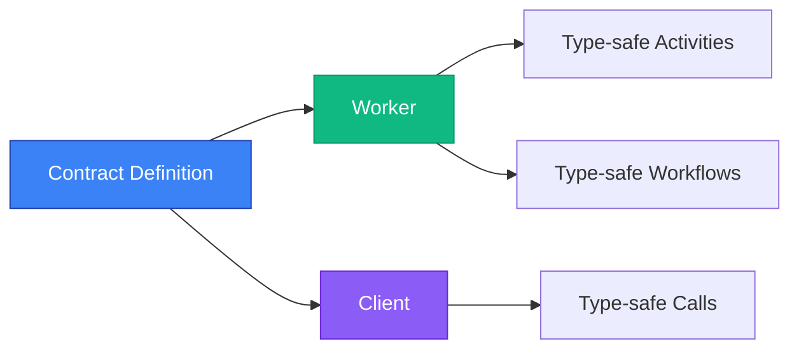

## The Problem

Working with [Temporal.io](https://temporal.io/) workflows is powerful, but comes with challenges:

```typescript
// ❌ No type safety
const result = await client.workflow.execute('processOrder', {
  workflowId: 'order-123',
  taskQueue: 'orders',
  args: [{ orderId: 'ORD-123' }],  // What fields? What types?
});

console.log(result.status);  // unknown type, no autocomplete

// ❌ Manual validation everywhere
// ❌ Runtime errors from wrong data
// ❌ Scattered activity definitions
```

## How It Works



## The Solution

**temporal-contract** transforms your Temporal workflows with a contract-first approach:

```typescript
// ✅ Define once
const contract = defineContract({
  taskQueue: 'orders',
  workflows: {
    processOrder: {
      input: z.object({ orderId: z.string(), customerId: z.string() }),
      output: z.object({ status: z.enum(['success', 'failed']), transactionId: z.string() }),
      activities: { /* ... */ }
    }
  }
});

// ✅ Type-safe client
const future = client.executeWorkflow('processOrder', {
  workflowId: 'order-123',
  args: { orderId: 'ORD-123', customerId: 'CUST-456' },  // TypeScript knows!
});

const result = await future;

result.match({
  Ok: (output) => {
    console.log(output.status);  // 'success' | 'failed' — full autocomplete!
  },
  Error: (error) => {
    console.error('Workflow failed:', error);
  },
});
```

## Quick Example

See how easy it is to get started with a complete workflow:

::: code-group

```typescript [1. contract.ts]
import { defineContract } from '@temporal-contract/contract';
import { z } from 'zod';

// ✅ Define your contract once
export const orderContract = defineContract({
  taskQueue: 'orders',
  workflows: {
    processOrder: {
      input: z.object({
        orderId: z.string(),
        customerId: z.string(),
        amount: z.number()
      }),
      output: z.object({
        status: z.enum(['success', 'failed']),
        transactionId: z.string().optional()
      }),
      activities: {
        processPayment: {
          input: z.object({
            customerId: z.string(),
            amount: z.number()
          }),
          output: z.object({ transactionId: z.string() }),
        },
        sendNotification: {
          input: z.object({
            customerId: z.string(),
            message: z.string()
          }),
          output: z.void(),
        },
      },
    },
  },
});
```

```typescript [2. activities.ts]
import { Future, Result } from '@swan-io/boxed';
import { declareActivitiesHandler, ActivityError } from '@temporal-contract/worker/activity';
import { orderContract } from './contract';

// ✅ Implement activities with full type safety
// Note: Activities use @swan-io/boxed for excellent performance
export const activities = declareActivitiesHandler({
  contract: orderContract,
  activities: {
    processOrder: {
      processPayment: ({ customerId, amount }) => {
        // Your actual payment service implementation
        return Future.fromPromise(
          paymentService.charge(customerId, amount)
        ).mapOk((transaction) => ({ transactionId: transaction.id }))
          .mapError((error) =>
            new ActivityError(
              'PAYMENT_FAILED',
              error instanceof Error ? error.message : 'Payment processing failed',
              error
            )
          );
      },

      sendNotification: ({ customerId, message }) => {
        // Your actual notification service implementation
        return Future.fromPromise(
          notificationService.send(customerId, message)
        ).mapError((error) =>
          new ActivityError(
            'NOTIFICATION_FAILED',
            error instanceof Error ? error.message : 'Failed to send notification',
            error
          )
        );
      },
    },
  },
});
```

```typescript [3. workflow.ts]
import { declareWorkflow } from '@temporal-contract/worker/workflow';
import { orderContract } from './contract';

// ✅ Type-safe workflow orchestration
// Note: Activities return plain values (Result is unwrapped by framework)
export const processOrder = declareWorkflow({
  workflowName: 'processOrder',
  contract: orderContract,
  implementation: async ({ activities }, { orderId, customerId, amount }) => {
    // Activities are fully typed and return plain values
    const payment = await activities.processPayment({
      customerId,
      amount,
    });

    const { transactionId } = payment;

    await activities.sendNotification({
      customerId,
      message: `Order ${orderId} confirmed!`,
    });

    // Return plain object (not Result - network serialization requirement)
    return { status: 'success', transactionId };
  },
});
```

```typescript [4. worker.ts]
import { Worker } from '@temporalio/worker';
import { orderContract } from './contract';
import { activities } from './activities';

// ✅ Start the worker
const worker = await Worker.create({
  workflowsPath: require.resolve('./workflows'),
  activities,
  taskQueue: orderContract.taskQueue,
});

await worker.run(); // Worker is now listening!
```

```typescript [5. client.ts]
import { TypedClient } from '@temporal-contract/client';
import { Connection, Client } from '@temporalio/client';
import { orderContract } from './contract';

// ✅ Type-safe client calls
const connection = await Connection.connect({ address: 'localhost:7233' });
const temporalClient = new Client({ connection });
const client = TypedClient.create(orderContract, temporalClient);

const future = client.executeWorkflow('processOrder', {
  workflowId: 'order-123',
  args: {
    orderId: 'ORD-123',
    customerId: 'CUST-456',
    amount: 99.99,
  },
});

const result = await future;

// Handle Result with pattern matching
result.match({
  Ok: (output) => {
    console.log(output.status); // 'success' | 'failed'
    console.log(output.transactionId); // string | undefined
  },
  Error: (error) => {
    console.error('Workflow failed:', error);
  },
});
```

:::

## What You Get

With temporal-contract, you get a complete, type-safe workflow system:

1. **Contract Definition** - Define your workflow interface once with Zod schemas
2. **Activity Implementation** - Implement business logic with full type safety
3. **Workflow Orchestration** - Coordinate activities with typed context
4. **Worker Setup** - Register activities and workflows automatically
5. **Type-safe Client** - Call workflows with autocomplete and validation

All parts work together seamlessly with end-to-end type safety!
