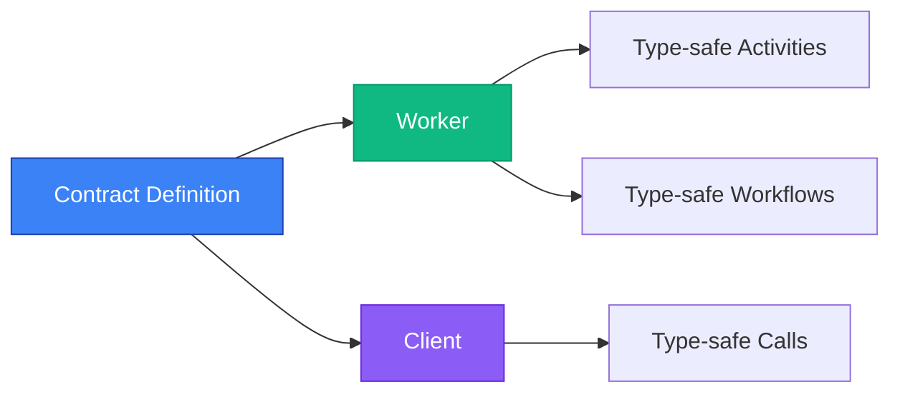

## The Problem

Working with [Temporal.io](https://temporal.io/) workflows is powerful, but comes with challenges:

```typescript
// ❌ No type safety
const result = await client.workflow.execute('processOrder', {
  workflowId: 'order-123',
  taskQueue: 'orders',
  args: [{ orderId: 'ORD-123' }],  // What fields? What types?
});

console.log(result.status);  // unknown type, no autocomplete

// ❌ Manual validation everywhere
// ❌ Runtime errors from wrong data
// ❌ Scattered activity definitions
```

## How It Works



## The Solution

**temporal-contract** transforms your Temporal workflows with a contract-first approach:

```typescript
// ✅ Define once
const contract = defineContract({
  taskQueue: 'orders',
  workflows: {
    processOrder: {
      input: z.object({ orderId: z.string(), customerId: z.string() }),
      output: z.object({ status: z.enum(['success', 'failed']), transactionId: z.string() }),
      activities: { /* ... */ }
    }
  }
});

// ✅ Type-safe client
const result = await client.executeWorkflow('processOrder', {
  workflowId: 'order-123',
  args: { orderId: 'ORD-123', customerId: 'CUST-456' },  // TypeScript knows!
});

console.log(result.status);  // 'success' | 'failed' — full autocomplete!
```

## Quick Example

See how easy it is to get started:

::: code-group

```typescript [contract.ts]
import { defineContract } from '@temporal-contract/contract';
import { z } from 'zod';

export const orderContract = defineContract({
  taskQueue: 'orders',
  workflows: {
    processOrder: {
      input: z.object({ orderId: z.string() }),
      output: z.object({ status: z.enum(['success', 'failed']) }),
      activities: {
        processPayment: {
          input: z.object({ amount: z.number() }),
          output: z.object({ transactionId: z.string() }),
        },
      },
    },
  },
});
```

```typescript [workflow.ts]
import { declareWorkflow } from '@temporal-contract/worker/workflow';

export const processOrder = declareWorkflow({
  workflowName: 'processOrder',
  contract: orderContract,
  implementation: async (context, { orderId }) => {
    const payment = await context.activities.processPayment({
      amount: 100
    });
    return { status: 'success' };
  },
});
```

```typescript [client.ts]
import { TypedClient } from '@temporal-contract/client';

const client = TypedClient.create(orderContract, { connection });

const result = await client.executeWorkflow('processOrder', {
  workflowId: 'order-123',
  args: { orderId: 'ORD-123' },
});

console.log(result.status); // ✅ Fully typed!
```

:::
